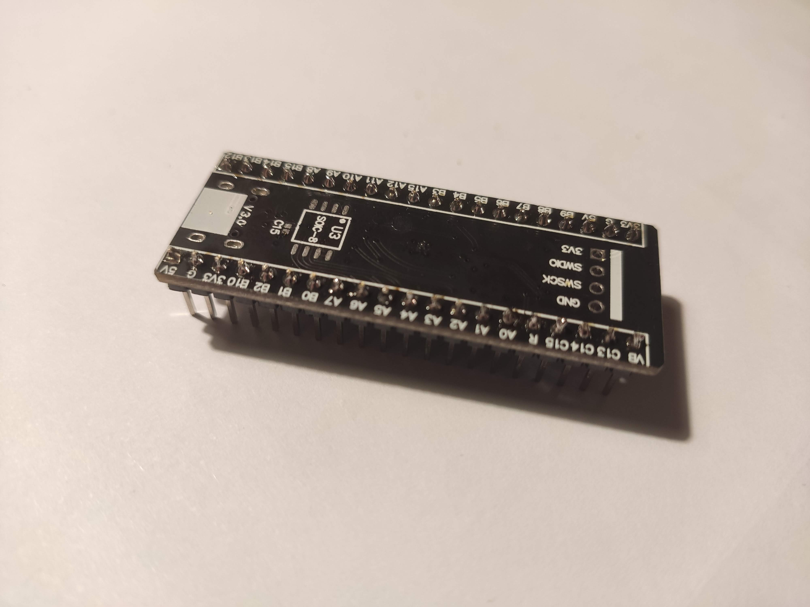
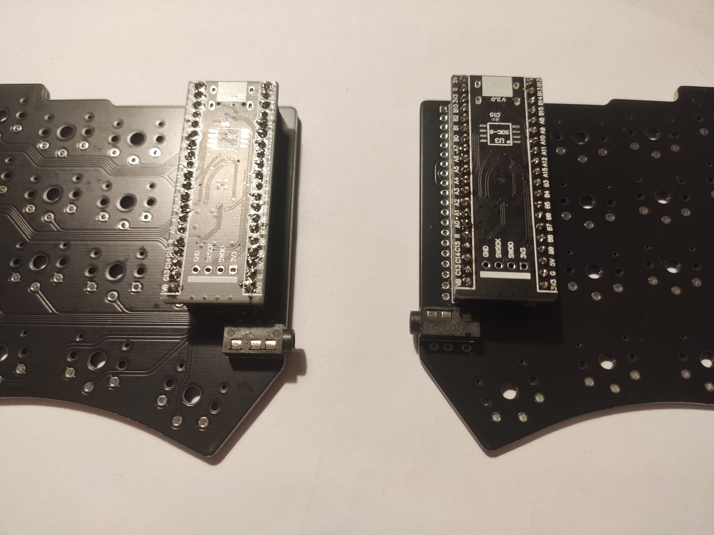
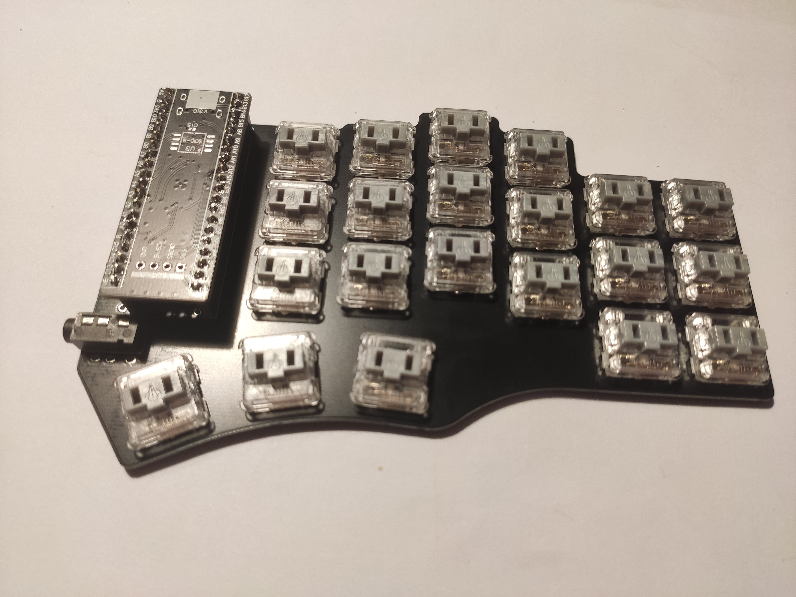
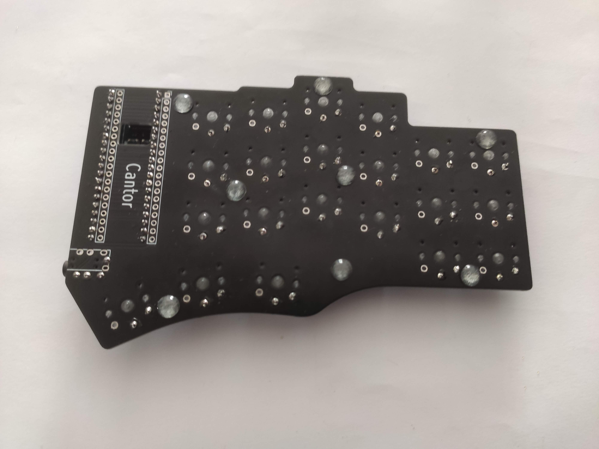

# Build Guide

1. Solder the pin headers to the blackpill microcontrollers. The microcontroller must be face down, as shown.

   

Optionally, flash the firmware onto the microcontroller to ensure it is not defective.

2. Solder the blackpill sockets and TRRS jacks on both PCBs, as shown. Sockets must be placed on top of the white PCB markings. ALthough using sockets is not strictly necessary, it will make it easier to replace the blackpills in case they die for any reason. Also, make sure you solder the components on different sides of the PCBs, so you end up with a right and left side and not two sides of the same hand.

   

3. Place and solder the switches.

   

4. Place the rubber feet on the bottom of the PCB.

   

5. Place the keycaps on top of the switches. Congrats! Your keyboard is built!
