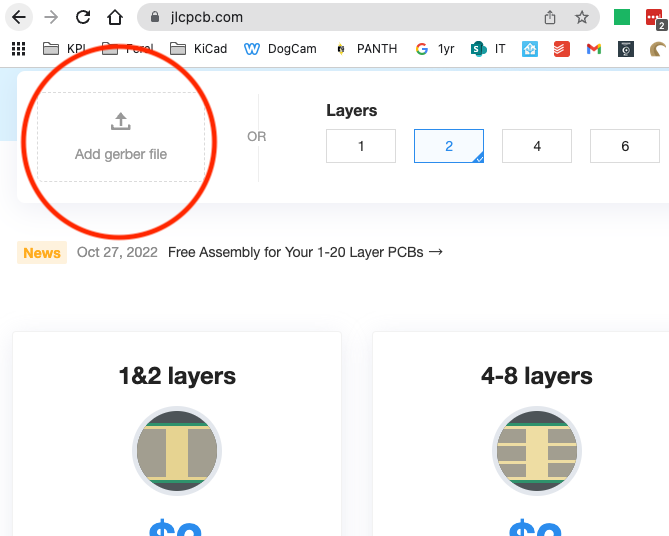
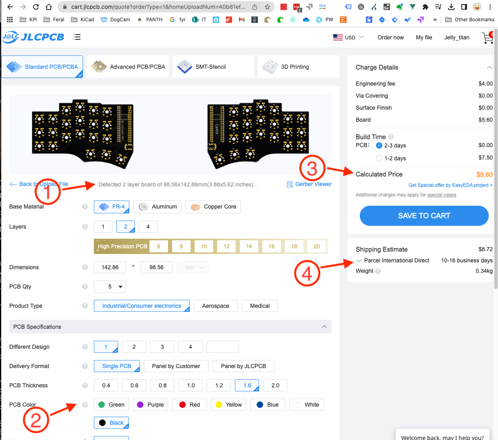
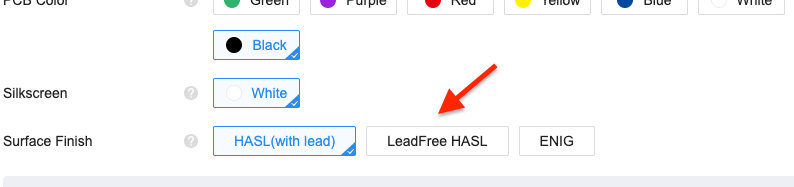

## How to order this board from a PCB vendor.

Helpful info if it's your first time ordering a PCB.

Most PCB vendors have a similar ordering process. I use [JLCPCB](https://jlcpcb.com/) because they are usually the most cost effective. I've had good luck with [Elecrow](https://www.elecrow.com/) too. [You can find PCB price comparison tools online.](https://pcbshopper.com/) When comparing pricing, the board dimensions are 99 x 143mm. (Usually anything under 100x100mm is really cheap - so be sure to use the 143x93 dimensions when pricing).

The production files are known as "gerbers", and they are usually uploaded as a `.zip` file. (It's essentially a collection of files for each layer of the board, like holes, graphics, traces etc.) In this repo, the file is at `cantor-choc-V2/pcb/Gerbers_ChocV2/Cantor_Choc_V2.zip`. (File & path name may change during development)

@todo - revise path before pull request.

The homepage of JLCPCB has a drag & drop upload. Drag the gerber `.zip` and drop it on the "add gerber file" box.

While the file is uploading, it will take you to an options screen. Once the board size is detected1, the price3 will update accordingly.
Changing the pcb color2 may impact production time and price.
Shipping estimates4 can vary widely, so be sure to check those. (You'll see these options again during checkout).

It's worth noting, the default pcb surface finish contains Lead. For boards in cases, this is usually not a problem. If you're going to rock a naked board, consider going with "lead free" for a few bucks more.

`@todo - Site sources?`

The remainder of the checkout process is standard ecommerce stuff. After you pay for your order, it will be reviewed before going into production. They will let you know if the file has any issues.